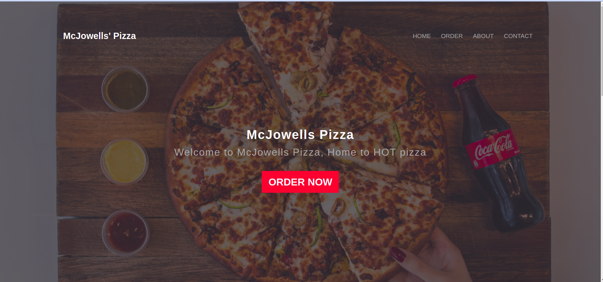

# McJowells Pizza

#### This is a Portfolio landing-page  website.
#### By **_Ian Njenga_**
-------------------------
## Description
The website is a landing page which has several features.Users are allowed to select which type of pizza they want. On top of that they are also required to select their favorite toppings with crust and their pizza size. Users can also add a location destination to where the delivery is going to be made. 
## Setup/Installation Requirements
There is no special installation needed. The website runs on all browsers. You can run it on chrome browser.

## Technologies Used
I used the following technologies;
- Html
- Css
- Bootstrap
- Javascript
- Jquery
## Support and contact details
You can reach me through ian.wanarua@student.moringaschool.com
### [Live demo](https://ianwanarua.github.io/McJowells-Pizza//)
### License
This project is under this [MIT](LICENSE)  
(c) 2021 **McJowells-Pizza**